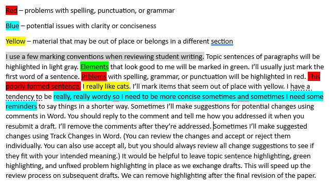

# Prewriting, Writing, & Rewriting:<br>PoWeR Writing for Graduate Students

Writing for graduate school can be broken down into phases or steps. The main steps are <ins>**P**</ins>rewriting, <ins>**W**</ins>riting, and <ins>**R**</ins>ewriting (Sainani, n.d.). This can be abbreviated using the acronym PWR. When sounding this out, it sounds a lot like the word "power". Conveniently enough, the word power contains a couple of additional letters that could represent other tasks we engage in during the writing process. "O" can stand for "organizing" and "E" can stand for "evaluating" (Krause, 2022). Taken all together, "PoWeR" represents a useful step-by-step process to write. In addition, "PoWeR" can also refer to turbocharging your writing process by using the many resources available at each step along the way. Here is a list of resources that may be helpful at each step of the writing process.

<br>  
<br>  

# <ins>P</ins>rewriting

Prewriting is the stage where you collect and organize information (Sainani, n.d.).

## Prewriting Workflow

1. Understand the requirements for your paper.
1. Find relevant evidence.
    1. Keep track of potential evidence sources with a citation manager.
1. Summarize how a relevant evidence source addresses an aspect of your paper.
    1. Use citations with your summaries.
1. Arrange your summary evidence into logical groupings in preparation for the writing phase.
2. Add notes of things you may want to say regarding your evidence and about the topic of your paper.
3. Arrange groupings into a logical order that will make sense to the reader.

## Understanding Requirements

### Features of Academic Writing

* Academic writing is structured, evidenced, critical, balanced, precise, objective, and formal. (https://www.eapfoundation.com/writing/what/)
  * Note that the video on the site linked above gives advice about how to write objectively, which is considered outdated. First, the speaker advises writers to use passive construction. Current practice is to use active construction as much as possible. (I like advice from George Gopen regarding when to use passive construction. https://www.georgegopen.com/uploads/1/0/9/0/109073507/litigation_10_why_the_passive_should_be_used.pdf) Second, the speaker advises writers not to use first-person pronouns. Current APA recommendations are to use first-person pronouns when describing actions you personally took. (https://apastyle.apa.org/style-grammar-guidelines/grammar/first-person-pronouns)

### Writing in a Genre

* A genre is a set of forms or standards expected by a community (Booth et. al., 2016). The genre we focus on in much of academic writing in nursing is the research report with five sections: Introduction, Methods, Results, Discussion, and Conclusion (Booth et. al., 2016).
* Much quality improvement reporting follows a more specific standard called Revised Standards for Quality Improvement Reporting Excellence or SQUIRE 2.0 guidelines (Ogrinc et. al., 2015). SQUIRE 2.0 follows a slightly shorter version of the five part research report called Introduction, Methods, Results, and Discussion (IMRAD). http://www.squire-statement.org/index.cfm?fuseaction=Page.ViewPage&PageID=471

### Divide a Paper into Sections

* If it has not been done already, you may find it beneficial to divide your paper into specific sections and understand the content that should be included in each section.
* Create an outline based on the required sections.

### Evaluating Evidence

* If you need to evaluate the strength of evidence, use a recognized framework.
* The Johns Hopkins model is suitable for evaluating a wide range of evidence (Dang et al., 2021).

## Prewriting Tools

Several tools can help with parts of the prewriting process.

### Finding Evidence

* Search scholarly databases.
  * Here is a link to the Eccles Library website https://library.med.utah.edu/
* I maintain a list of AI literature search tools.
  * Searching for Literature https://github.com/cmcntsh/LitSearchAIResources

### Working with References

If you are citing more than a handful of sources in your writing, I recommend using a citation manager. You have to take the time to ensure your references are formatted correctly in any papers you write. Using a citation manager allows you to import literature quickly and check the formatting once instead of checking the formatting every time the reference is used in a paper. 

* Zotero is available for free. It has some nice integration with web browsers and allows you to share references with groups. https://www.zotero.org/
  * How to use Zotero (A complete beginner's guide) (13 min) https://www.youtube.com/watch?v=JG7Uq_JFDzE
  * How to use Zotero 2023 - Full tutorial with examples (25 min) https://www.youtube.com/watch?v=tnbwKj6-pD8
  * Reading, annotating, note-taking, and drafting/outlining with Zotero 6 (20 min) https://www.youtube.com/watch?v=pZTjiSSOsE4
  * Best add-ons in Zotero | easy to use | better notes | literature review mindmap | research (11 min) https://www.youtube.com/watch?v=DgiG-H4tjSI
* If you're a student at the University of Utah, EndNote is available for a reasonable cost from the [Office of Software Licensing](https://software-catalog.app.utah.edu/product/1076). (I currently prefer working with Zotero. It's free and in many ways I find it easier to use.)
* I recommend purchasing the most current APA manual. As of 2023 that is APA 7 (American Psychological Association, 2020). However, many things can be looked up online on the APA Style Blog https://apastyle.apa.org/
* (new in 2023) APA has come out with guidance on citing ChatGPT https://apastyle.apa.org/blog/how-to-cite-chatgpt . You should mention in the Methods section of your paper how you used AI tools if you used them as part of your workflow.

### AI Prompts to Help Organize Text

I currently recommend these tools for general-purpose text prompts:

| Link | Model | Company | Testing Status | Limitations | As of Date |
| --- | --- | --- | --- | --- | --- |
| https://chat.openai.com/ | GPT 3.5 | OpenAI | moderate testing | confused on more complex tasks | 01/31/2024 |
| https://copilot.microsoft.com/ | GPT 4.0 Turbo | Microsoft | little testing | 2000 character input limit (need to split text up into chunks) | 01/31/2024 |
| https://claude.ai/chats | Claude | Anthropic | little testing | | 01/31/2024 |
| https://gemini.google.com/app | Gemini | Google | little testing | superficial analysis, minimal feedback on writing evaluation | 02/26/2024 |
| https://chat.mistral.ai/chat | Mistral Large | Mistral | Untested |  | 02/26/2024 |
| https://www.meta.ai/ | Llama 3 | Meta (Facebook) | untested | Seemed to struggle with longer prompt (4 pages of double-spaced text in Word) | 04/23/2024 |
| https://chat.deepseek.com/ | DeepSeek | DeepSeek AI | untested |  | 01/28/2025 |

Prompt:

```
Please organize this text into the following categories: 1) [category 1], 2) [category 2], 3) [category 3] Here is the text: "[paste your text here]"
```

<br>  
<br>  

# <ins>W</ins>riting

Writing is the stage where you produce your first draft of organized text. At this stage, it's more important to get a first draft written than it is to have a well-written first draft (Sainani, n.d.). Worry about revising later.

## Writing Workflow

1. Work from your outline and notes created during the prewriting phase.
2. Write a draft of your paper or paper section using full sentences.
3. Don't overthink this step. It's most important to get your thoughts down on paper than it is to have everything done well. You will work on how well things are done in the rewriting phase.

## Writing Tools

* I always recommend the use of Grammarly. Graduate students at the U of U have free access. https://gradschool.utah.edu/resources-hub/grammarly/index.php
* The [Graduate Student Writing Center](https://writingcenter.utah.edu/) is a good resource for writing help.

### AI Prompts to Help with Writing

I currently recommend these tools for general-purpose text prompts: (See tools at https://github.com/cmcntsh/PoWeRWritingGradStudents#ai-prompts-to-help-organize-text)

#### Help writing paragraphs

Prompt:

```
Please help me write this text as an engaging paragraph. Here is the text: "[paste your text here inside quotes]"
```

#### Help writing topic sentences for paragraphs

Prompt:

```
Please suggest three possible topic sentences for the following paragraph. Here is the text: "[paste your text here inside quotes]"
```

<br>  
<br>  

# <ins>R</ins>ewriting

Rewriting or revision is the stage where most evaluation takes place. Rewriting is an iterative process, and multiple checks and revisions may be needed to ensure adequate coverage of the intended material, correct spelling and grammar are used, and other stylistic choices lead to the clearest writing possible and the best experience for the reader. In professional publishing, editing is often broken down into three main phases: substantive editing - focused on structure and organization; copyediting - focused on correcting sentence problems; and proofreading - focused on final appearance (Grammarly, 2023).

## Rewriting Workflow

1. Correct grammar and punctuation before sending your work to other people. (See AI Prompts to Help with Rewriting below.)
2. Evaluate the comprehensiveness of content coverage. (See AI Prompts to Help with Rewriting below.)
1. Edit for grammar and punctuation. (See AI Prompts to Help with Rewriting below.)
2. Edit for structure and organization. (See AI Prompts to Help with Rewriting below.)
3. Edit for clarity and conciseness. (See AI Prompts to Help with Rewriting below.)
4. Edit for consistent tone. (See AI Prompts to Help with Rewriting below.)
5. Reader Expectation Approach considerations (See Reader Expectation Approach to Writing link below.)
    1. Is the main action of each sentence conveyed by the verb?
    2. Do any sentences have long subject-verb separations making them hard to read?
    3. Does the topic position of each sentence have the correct entity for the intended story?
    4. Does each sentence have the old information needed to link backward in the Topic position?
    5. Is stressworthy information in each sentence in a stress position?
    6. Is the paragraph issue in the first one to three sentences of the paragraph?
    7. Does the paragraph have a point? Is it articulated in the correct place?

## Manual Writing Analysis Techniques

Automated writing tools have come a long way, but they're still not a complete replacement for your most powerful writing tool - your own ability to craft what you intend to say. Train your brain to recognize and produce good writing. The rest of the tools listed in this guide will be of limited use if you don't have good analytical skills.

### Reader Expectation Approach to Writing

I attended a presentation by an emeritus professor of rhetoric named George Gopen in 2023, where I was introduced to the Reader Expectation Approach to writing. The gist of his method is that the writer needs to consider how readers of English prose usually interpret the meaning of sentences and write so readers are more likely to interpret the intended meaning of a work. Dr. Gopen has published a number of works, but I **HIGHLY** recommend his series of articles on litigation. They're free to access and easy to digest (Available at https://www.georgegopen.com/litigation-articles.html) Most of the articles are 1-2 pages long. He describes how to structure writing to facilitate reader interpretation of the intended meaning. He answers such questions as: When should passive voice be used? When is a sentence too long or too short? How to reinforce key points? And how do you write for clarity and ease of reading? (You may wonder what articles on litigation have to do with scientific or academic writing. The answer is scientific and academic writing is usually about making an argument and supporting it with evidence. If you read the articles, you will see they are very relevant.) I might mention that he has consulted on writing grant proposals that have been awarded hundreds of millions of dollars in research funding.

* Reader Expectation Approach readings and exercises https://github.com/cmcntsh/ReaderExpectationReadingExercises

### Analyze the Rhetorical Purpose of a Piece of Writing

I did exercises like this during my PhD program. They were very useful for helping me understand writing better.

* Understanding What You Read with the Rhetorical Precis (13 min) https://www.youtube.com/watch?v=w2uICmMcKxI

### Paragraphs

* A lot of final refinement work will consist of evaluating and refining the content and order of your paragraphs.
  * Here are some nice articles on what you should understand about the purpose of paragraphs and how to structure paragraphs.
    * [The Ultimate Guide to Paragraphs](https://www.grammarly.com/blog/paragraphs/) (Ellis, 2021a)
    * [How to Write Strong Paragraphs](https://www.grammarly.com/blog/paragraph-structure/) (Ellis, 2022)
    * [On Paragraphs](https://owl.purdue.edu/owl/general_writing/academic_writing/paragraphs_and_paragraphing/index.html) (Purdue Online Writing Lab, 2022a)
    * "You may have learned that every paragraph should begin with a topic sentence and be directly relevant to the section in which it appears. Those are good rules of thumb, but applied too strictly they can make your writing seem stiff. The important thing is to structure and arrange your paragraphs so that they lead your readers through the conversation you are orchestrating. Open each paragraph with a sentence or two that signal its key concepts. Doing that will help readers better understand what follows. If your opening doesn't also state the paragraph's point, then your last sentence should. Never bury the point in the middle." (Booth et al, 2016, p. 195)
    * "There is no minimum or maximum sentence length in APA Style. Overuse of short, simple sentences produces choppy prose, however, and overuse of long, involved sentences results in difficult, sometimes incomprehensible, language. Varied sentence length helps readers maintain interest and comprehension. When involved concepts require long sentences, the components should proceed logically. Avoid including multiple ideas in a single sentence; instead, break the sentence into shorter ones. Direct, declarative sentences with simple, common words are usually best.
Similar cautions apply to paragraph length. Single-sentence paragraphs are abrupt and should be used infrequently. Paragraphs that are too long (i.e., longer than one double-spaced manuscript page) risk losing readers' attention. A new paragraph signals a shift to a new idea and provides a pause for readers - a chance to assimilate one step in the conceptual development before beginning another. Look for a logical place (or places) to break up a long paragraph or reorganize the material." (American Psychological Association, 2020, p. 115)
    * What's at Issue? The Construction of the English Paragraph, Part I https://www.georgegopen.com/uploads/1/0/9/0/109073507/litigation_19_construction-english-paragraph.pdf
    * What's at Issue? The Construction of the English Paragraph, Part II https://www.georgegopen.com/uploads/1/0/9/0/109073507/litigation_20_whats_at_issue_part_2.pdf
    * Connectivity: The Construction of the English Paragraph, Part III https://www.georgegopen.com/uploads/1/0/9/0/109073507/litigation_21_connectivity.pdf
    * The Point of a Paragraph and Where to Find It: The Construction of the English Paragraph, Part IV https://www.georgegopen.com/uploads/1/0/9/0/109073507/litigation_22_point-of-paragraph.pdf
    * Five Varieties of Point Placement: The Construction of the English Paragraph, Part V https://www.georgegopen.com/uploads/1/0/9/0/109073507/litigation_23_five-varieties-point-placement.pdf
    * How Paragraphs Speak to Each Other https://www.georgegopen.com/uploads/1/0/9/0/109073507/litigation_24_--_how_paragraphs_speak_to_each_other.pdf
  * One exercise you can use to evaluate the quality of your paragraphs and the sequence of your logic is called Reverse Outlining.
    * [Reverse Outlining: An Exercise for Taking Notes and Revising Your Work](https://owl.purdue.edu/owl/general_writing/the_writing_process/reverse_outlining.html) (Purdue Online Writing Lab, n.d.)
    * [Reverse Outlines: A Writer's Technique for Examining Organization](https://writing.wisc.edu/handbook/process/reverseoutlines/) (The Writing Center, n.d.)
    
### Sentences
    
* This work will also consist of evaluating and refining your sentences.
  * [How to Write Better Sentences](https://www.grammarly.com/blog/sentences/) (Ellis, 2021b)
  * [How to Write Excellent Sentences: A Guide to Sentences Structure](https://blog.streetwriters.co/how-to-write-good-sentences/) (Streetwriters, 2021)
  * Where does punctuation come from? (19 min) https://www.youtube.com/watch?v=k9Re5otW-v0
  * (new in 2023) ChatGPT (https://openai.com/blog/chatgpt/) can also help fix problem sentences.
  * The Importance of Stress: Indicating the Most Important Words in a Sentence https://www.georgegopen.com/uploads/1/0/9/0/109073507/litigation_2_stress_position.pdf
  * Ensuring readers Know What Actions Are Happening in Any Sentence https://www.georgegopen.com/uploads/1/0/9/0/109073507/litigation_3_actions_and_verbs.pdf
  * Whose Story Is This Sentence? Directing Readers' Perception of Narrative https://www.georgegopen.com/uploads/1/0/9/0/109073507/litigation_4_whose_story.pdf
  * How to Overburden Your Reader; Separate Your Subject from Your Verb https://www.georgegopen.com/uploads/1/0/9/0/109073507/litigation_8_s_v_c_separation.pdf
  * A Quiver of Punctuation: How to Handle Two Clauses in One Sentence https://www.georgegopen.com/uploads/1/0/9/0/109073507/litigation_25_punctuation_quiver___handling_2_clauses_in_1_sentence.pdf
 
### Professional Voice

* [Tone in Business Writing](https://owl.purdue.edu/owl/subject_specific_writing/professional_technical_writing/tone_in_business_writing.html) (Purdue Online Writing Lab, 2022)
* [How to Make Writing Sound More Professional](https://www.grammarly.com/business/learn/how-to-make-your-writing-sound-more-professional/) (Grammarly Business, 2021)

### Analysis Example

#### Here are the things I’m looking for: 

* Section Content (appropriate and complete)
* Evidence (citations used when summarizing, paraphrasing, or quoting)
* APA (spelling, grammar, headings, citation formatting, reference formatting, tables, figures, appendices)
* Logic and Flow (well-formed paragraphs, topic sentences, suitable transitions, logical arrangement, clearly written sentences)

#### Highlighting:



## Rewriting Tools

* I always recommend the use of Grammarly. Graduate students at the U of U have free access. https://gradschool.utah.edu/resources-hub/grammarly/index.php
* The [Graduate Student Writing Center](https://writingcenter.utah.edu/) is a good resource.

### AI Prompts to Help with Rewriting

I currently recommend these tools for general-purpose text prompts: (See tools at https://github.com/cmcntsh/PoWeRWritingGradStudents/blob/main/README.md#ai-prompts-to-help-organize-text) I would use the following prompts on individual sections of your paper and not the entire paper all at once. I would use each prompt individually, evaluate the suggested changes, and update your text as desired before moving to the next prompt. I would then use your revised text as the starting point for the next editing prompt.

#### Preliminary check of grammar and spelling before sending your work to others

Prompt: Review each sentence for spelling, grammar, and punctuation problems (This prompt worked slightly better if I did it in two steps. Step 1 - Ask for each sentence to be split into a separate line and numbered and submit the text. Step 2 - Ask for a review of each sentence for grammar, syntax, usage, spelling and punctuation errors and specific suggestions for improvements.)

```
Please list each sentence of this text in a new line, and please number the lines. In addition, please review each sentence for grammar, syntax, usage, spelling, and punctuation errors and suggest specific improvements. When suggesting revisions, please list the sentence number, the original sentence, the reason a revision might be needed, and then the revised sentence. If no revision is suggested, please indicate that no revision is needed.  Here is the text: "[paste text here inside quotes]"
```

#### Evaluate the Comprehensiveness of Content Coverage

You can evaluate a paper or paper section for how well relevant elements are addressed.

Prompt:

```
How well does the following text answer each of these questions? Question 1? Question 2? Question 3? Etc? 
Here is the text: "[Paste the text you want evaluated here.]"
```

#### Evaluate the Discourse Relations Between the Topic of a Paragraph and Each Sentence

This prompt relies on discourse relations as defined in Rhetorical Structure Theory (RST). It is a way to analyze how each sentence is related to the main topic in a paragraph. (Some paragraphs are more cohesively constructed than others.) The prompt worked in ChatGPT on its own, but it may do better if RST background information is loaded into ChatGPT first.

* RST discourse relationship definitions page: https://www.sfu.ca/rst/01intro/definitions.html

Stand-alone prompt:

```
Here is my analysis request. You are an expert in rhetorical structure theory. I need you to help me evaluate the discourse relationship between the main topic of a paragraph and each sentence in the paragraph. Please list each sentence on a separate line and number each sentence. For each sentence please assign a discourse relation. (The available relationship options are antithesis, background, concession, enablement, evidence, justify, motivation, preparation, restatement, summary, circumstance, condition, elaboration, evaluation, interpretation, means, cause, result, otherwise, purpose, solutionhood, unconditional, unless, conjunction, contrast, disjunction, joint, list, restatement, sequence, and no discourse relationship identified.) In addition, please rate the strength of the relationship between the topic and the sentence. (The available strength options are no relationship, weakly related, and strongly related.) Here is the main topic of the paragraph: "[paste topic sentence here]" Here are the sentences in the paragraph: "[paste paragraph sentences here]"
```

Prompts to load RST background information: These prompts are submitted in succession, then the stand-alone prompt (above) with the text for analysis is submitted at the end. The text for the background prompts comes from the RST definitions web page link given above.

```
I'm going to give you some background on Rhetorical Structure Theory and then I'm going to give you a request to analyze some text based on the background. Don't respond until I give you a request that begins with "Here is my analysis request:"
```

```
Here is the background about Rhetorical Structure Theory: The basic paper on RST, published in Text 8(3), was derived from an earlier report, ISI-RS-87-190. That report had, along with the relation definitions, one or more examples and some commentary for each relation. Portions of that information are available from the bibliographies section in this website, and an example has also been included for each of the four newer relations mentioned below. Some of the examples are from other sources, including the analyses in other sections of the website. To find these examples, look just below each table of relation definitions.

Each element of the definition is implicitly embedded in a constraint formula as follows: "It is plausible to the analyst that it was plausible to the author that ... ."

On terminology in definitions: N stands for nucleus, S for satellite, W for writer (author, speaker) and R for reader (hearer.) For some brevity: in many places, N and S stand for the situations presented by N and S; N and S never stand for the text of N or S. Situation is a broad cover term that ranges over propositions or beliefs, actions whether realized or not, desires to act and approval for another to act. Similarly, positive regard is a broad attitudinal term that ranges over belief, approval of ideas, desire to act, and approval for another to act, all identifiably positive. Positive regard and belief (with its cognates), and plausible above are all degree terms, not binary.

Notice that the name of the relation does not enter into the use of the definition. Finding good names for all of the relations is difficult or perhaps impossible, so some of the definitions will seem inappropriate for the name; see, for example, Justify.

The relations are classified into two main types: nucleus-satellite and multinuclear (see the Introduction). They can also be classified according to whether they are Presentational or Subject Matter. Presentational relations are those whose intended effect is to increase some inclination in the reader, such as the desire to act or the degree of positive regard for, belief in, or acceptance of the nucleus. Subject matter relations are those whose intended effect is that the reader recognizes the relation in question.

In the three tables below, we present the relation name and its definition. By clicking on the relation name, you can see further examples and comments on each relation.
```

```
Definitions of Presentational Relations
Relation Name
Constraints on either S or N individually
Constraints on N + S
Intention of W
Antithesis	on N: W has positive regard for N	N and S are in contrast (see the Contrast relation); because of the incompatibility that arises from the contrast, one cannot have positive regard for both of those situations; comprehending S and the incompatibility between the situations increases R's positive regard for N	R's positive regard for N is increased
Background	on N: R won't comprehend N sufficiently before reading text of S	S increases the ability of R to comprehend an element in N	R's ability to comprehend N increases
Concession	on N: W has positive regard for N
on S: W is not claiming that S does not hold;	W acknowledges a potential or apparent incompatibility between N and S; recognizing the compatibility between N and S increases R's positive regard for N	R's positive regard for N is increased
Enablement	on N: presents an action by R (including accepting an offer), unrealized with respect to the context of N	R comprehending S increases R's potential ability to perform the action in N	R's potential ability to perform the action in N increases
Evidence	on N: R might not believe N to a degree satisfactory to W
on S: R believes S or will find it credible	R's comprehending S increases R's belief of N	R's belief of N is increased
Justify	none	R's comprehending S increases R's readiness to accept W's right to present N	R's readiness to accept W's right to present N is increased
Motivation	on N: N is an action in which R is the actor (including accepting an offer), unrealized with respect to the context of N	Comprehending S increases R's desire to perform action in N	R's desire to perform action in N is increased
Preparation	none	S precedes N in the text; S tends to make R more ready, interested or oriented for reading N	R is more ready, interested or oriented for reading N
Restatement	none	on N + S: S restates N, where S and N are of comparable bulk; N is more central to W's purposes than S is.	R recognizes S as a restatement of N
Summary	on N: N must be more than one unit	S presents a restatement of the content of N, that is shorter in bulk	R recognizes S as a shorter restatement of N
```

```
Definitions of Subject Matter Relations
Relation Name
Constraints on either S or N individually
Constraints on N + S
Intention of W
Circumstance	on S: S is not unrealized	S sets a framework in the subject matter within which R is intended to interpret N	R recognizes that S provides the framework for interpreting N
Condition	on S: S presents a hypothetical, future, or otherwise unrealized situation (relative to the situational context of S)	Realization of N depends on realization of S	R recognizes how the realization of N depends on the realization of S
Elaboration	none	S presents additional detail about the situation or some element of subject matter which is presented in N or inferentially accessible in N in one or more of the ways listed below. In the list, if N presents the first member of any pair, then S includes the second:
set :: member
abstraction :: instance
whole :: part
process :: step
object :: attribute
generalization :: specific
R recognizes S as providing additional detail for N. R identifies the element of subject matter for which detail is provided.
Evaluation	none	on N + S: S relates N to degree of W's positive regard toward N.	R recognizes that S assesses N and recognizes the value it assigns
Interpretation	none	on N + S: S relates N to a framework of ideas not involved in N itself and not concerned with W's positive regard	R recognizes that S relates N to a framework of ideas not involved in the knowledge presented in N itself
Means	on N: an activity	S presents a method or instrument which tends to make realization of N more likely	R recognizes that the method or instrument in S tends to make realization of N more likely
Non-volitional Cause	on N: N is not a volitional action	S, by means other than motivating a volitional action, caused N; without the presentation of S, R might not know the particular cause of the situation; a presentation of N is more central than S to W's purposes in putting forth the N-S combination.	R recognizes S as a cause of N
Non-volitional Result	on S: S is not a volitional action	N caused S; presentation of N is more central to W's purposes in putting forth the N-S combination than is the presentation of S.	R recognizes that N could have caused the situation in S
Otherwise	on N: N is an unrealized situation
on S: S is an unrealized situation	realization of N prevents realization of S	R recognizes the dependency relation of prevention between the realization of N and the realization of S
Purpose	on N: N is an activity;
on S: S is a situation that is unrealized	S is to be realized through the activity in N	R recognizes that the activity in N is initiated in order to realize S
Solutionhood	on S: S presents a problem	N is a solution to the problem presented in S;	R recognizes N as a solution to the problem presented in S
Unconditional	on S: S conceivably could affect the realization of N	N does not depend on S	R recognizes that N does not depend on S
Unless	none	S affects the realization of N; N is realized provided that S is not realized	R recognizes that N is realized provided that S is not realized
Volitional Cause	on N: N is a volitional action or else a situation that could have arisen from a volitional action	S could have caused the agent of the volitional action in N to perform that action; without the presentation of S, R might not regard the action as motivated or know the particular motivation; N is more central to W's purposes in putting forth the N-S combination than S is.	R recognizes S as a cause for the volitional action in N
Volitional Result	on S: S is a volitional action or a situation that could have arisen from a volitional action	N could have caused S; presentation of N is more central to W's purposes than is presentation of S;	R recognizes that N could be a cause for the action or situation in S
```

```
Definitions of Multinuclear Relations
Relation Name
Constraints on each pair of N
Intention of W
Conjunction	The items are conjoined to form a unit in which each item plays a comparable role
R recognizes that the linked items are conjoined
Contrast	No more than two nuclei; the situations in these two nuclei are (a) comprehended as the same in many respects (b) comprehended as differing in a few respects and (c) compared with respect to one or more of these differences	R recognizes the comparability and the difference(s) yielded by the comparison is being made
Disjunction	An item presents a (not necessarily exclusive) alternative for the other(s)
R recognizes that the linked items are alternatives
Joint	None	none
List	An item comparable to others linked to it by the List relation	R recognizes the comparability of linked items
Multinuclear Restatement	An item is primarily a reexpression of one linked to it; the items are of comparable importance to the purposes of W	R recognizes the reexpression by the linked items
Sequence	There is a succession relationship between the situations in the nuclei	R recognizes the succession relationships among the nuclei.
```

#### Edit for clarity and conciseness

Prompt

```
Please review my text for clarity and conciseness. Check for any areas where the language could be clearer or more concise. If you identify any redundant or overly complex sentences, suggest specific revisions to enhance clarity and brevity. Here is the text: "[past text here in quotes]".
```

#### Edit for consistent tone

Prompt

```
Please review my text for consistent tone in academic writing. Ensure that the language is formal, objective, and avoids any elements that may be too casual or subjective. If you identify any instances where the tone may need adjustment for a more formal and scholarly demeanor, please provide specific suggestions. Here is the text: "[past text here in quotes]".
```

#### Generate a writing report and suggested revision 

Prompt: (I get inconsistent results with the report, but the revision text is not bad.)

```
Please generate a report about the following text, which is enclosed by double quotes, based on the following criteria:
Identify grammar, syntax, usage, spelling, and punctuation errors and suggest specific improvements;
in addition, Report document statistics;
in addition, Report vocabulary statistics:
in addition, Report the readability score;
in addition, Report the tone type (available options are Formal, Informal, Optimistic, Worried, Friendly, Curious, Assertive, Encouraging, Surprised, or Cooperative);
in addition, Report the intent type (available options are  Inform, Describe, Convince, or Tell A Story);
in addition, Report the audience type (available options are General, Knowledgeable, or Expert);
in addition, Report the style type (available options are formal or informal);
in addition, Report the emotion type (available options are mild or strong);
in addition, Report the domain type (available options are General, Academic, Business, Technical, Creative, or Casual);
in addition, Report the Flesch-Kincaid Grade Level.
Please provide revised text that adheres to the following instructions:
If the Flesh-Kincaid Grade level of the text is higher than 15, can you rewrite the text so that the grade level should be around 15, assuming that the audience type is Knowledgeable or Expert;
In addition, if the domain type of the text is Casual, then the text that you rewrite should have a domain type that is either academic or technical;
In addition, if the intent type of the text is Convince, then the text that you rewrite should have an intent type that is either Describe or Inform;
In addition, if the style type of the text is Informal, then the text that you rewrite should have a style type that is Formal;
In addition, if the emotion type of the text is Strong, then the text that you rewrite should have a style type that is Mild.
Here is the text: "[paste text here]"
```

### Track Changes and comments in Word:

* This link explains how to use [Track Changes in Word](https://support.microsoft.com/en-us/office/track-changes-in-word-197ba630-0f5f-4a8e-9a77-3712475e806a).
* This link explains how to use [Comments in Word](https://support.microsoft.com/en-us/office/insert-or-delete-a-comment-8d3f868a-867e-4df2-8c68-bf96671641e2).
* Sometimes it's easy to forget to turn on Track Changes or Track Changes has a problem and not all changes are captured. Word also has a document compare tool that shows similarities and differences between two documents. This link explains how to use [Compare Documents in Word](https://support.microsoft.com/en-us/office/compare-and-merge-two-versions-of-a-document-f5059749-a797-4db7-a8fb-b3b27eb8b87e).

<br>  
<br>  

# References

* American Psychological Association (Washington, District of Columbia) (Ed.). (2020). *Publication manual of the American psychological association (Seventh edition)*. American Psychological Association.
* Booth, W. C., Colomb, G. G., Williams, J. M., Bizup, J., & FitzGerald, W. T. (2016). *The craft of research (Fourth edition)*. The University of Chicago Press.
* Dang, D., Dearholt, S. L., Bissett, K., Whalen, M., & Ascenzi, J. (2021). *Johns Hopkins evidence-based practice for nurses and healthcare professionals: Model & guidelines (Fourth edition)*. Sigma Theta Tau International.
* Ellis, M. (2021a). *The ultimate guide to paragraphs*. Grammarly, Inc. Retrieved November 18 from https://www.grammarly.com/blog/paragraphs/
* Ellis, M. (2021b). *How to write better sentences*. Grammarly, Inc. Retrieved November 18 from https://www.grammarly.com/blog/sentences/
* Ellis, M. (2022, June 2, 2022). *How to write strong paragraphs*. Grammarly, Inc. Retrieved November 18 from https://www.grammarly.com/blog/paragraph-structure/
* Grammarly. (2023, October 28). How to edit writing in 3 steps. https://www.grammarly.com/blog/editing/
* Krause, T. (2022). 2.5 Getting ready to write: The P.O.W.E.R. writing process. In OpenOregon Educational Resources, *Synthesis*. https://openoregon.pressbooks.pub/synthesis/chapter/getting-ready-to-write-the-p-o-w-e-r-writing-process/
* Ogrinc, G., Davies, L., Goodman, D., Batalden, P., Davidoff, F., & Stevens, D. (2016). SQUIRE 2.0 ( Standards for QUality Improvement Reporting Excellence): Revised publication guidelines from a detailed consensus process: Table 1. *BMJ Quality & Safety*, 25(12), 986–992. https://doi.org/10.1136/bmjqs-2015-004411
* Purdue Online Writing Lab. (n.d.). *Reverse outlining: An exercise for taking notes and revising your work*. Purdue University. Retrieved November 18, 2022 from https://owl.purdue.edu/owl/general_writing/the_writing_process/reverse_outlining.html
* Purdue Online Writing Lab. (2022a). *On Paragraphs*. Purdue University. Retrieved January 25, 2023 from https://owl.purdue.edu/owl/general_writing/academic_writing/paragraphs_and_paragraphing/index.html
* Purdue Online Writing Lab. (2022b). *Tone in business writing*. Retrieved February 7, 2023 from https://owl.purdue.edu/owl/subject_specific_writing/professional_technical_writing/tone_in_business_writing.html
* Sainani, K. (n.d.). 4.2 Overview of the writing process [Coursera lecture]. In Stanford University, *Writing in the sciences*. Coursera. Retrieved December 24, 2023, from https://www.coursera.org/learn/sciwrite/lecture/vPzd8/4-3-the-pre-writing-step
* Streetwriters. (2021, March 15, 2021). *How to write excellent sentences: A guide to sentences structure*. Streetwriters LLC. Retrieved November 18, 2022 from https://blog.streetwriters.co/how-to-write-good-sentences/
* The Writing Center. (n.d.). *Reverse outlines: A writer's technique for examing organization*. University of Wisconsin - Madison. Retrieved November 18, 2022 from https://writing.wisc.edu/handbook/process/reverseoutlines/ 


