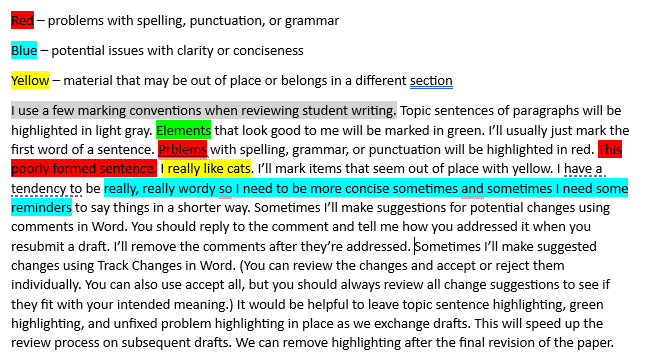

# Prewriting, Writing, & Rewriting:<br>PoWeR Writing for Graduate Students

Writing for graduate school can be broken down into phases or steps. The main steps are <ins>**P**</ins>rewriting, <ins>**W**</ins>riting, and <ins>**R**</ins>ewriting (Sainani, n.d.). This can be abbreviated using the acronym PWR. When sounding this out, it sounds a lot like the word "power". Conveniently enough, the word power contains a couple of additional letters that could represent other tasks we engage in during the writing process. "O" can stand for "organizing" and "E" can stand for "evaluating" (Krause, 2022). Taken all together, "PoWeR" represents a useful step-by-step process to write. In addition, "PoWeR" can also refer to turbocharging your writing process by using the many resources available at each step along the way. Here is a list of resources that may be helpful at each step of the writing process.

<br>  
<br>  

# <ins>P</ins>rewriting

Prewriting is the stage where you collect and organize information (Sainani, n.d.).

## Prewriting Workflow

1. Understand the requirements for your paper.
1. Find relevant evidence.
    1. Keep track of potential evidence sources with a citation manager.
1. Summarize how a relevant evidence source addresses an aspect of your paper.
    1. Use citations with your summaries.
1. Arrange your summary evidence into logical groupings in preparation for the writing phase.
2. Add notes of things you may want to say regarding your evidence and about the topic of your paper.
3. Arrange groupings into a logical order that will make sense to the reader.

## Understanding Requirements

### Writing in a Genre

* A genre is a set of forms or standards expected by a community (Booth et. al., 2016). The genre we focus on in much of academic writing in nursing is the research report with five sections: Introduction, Methods, Results, Discussion, and Conclusion (Booth et. al., 2016).
* Much quality improvement reporting follows a more specific standard called Revised Standards for Quality Improvement Reporting Excellence or SQUIRE 2.0 guidelines (Ogrinc et. al., 2015). SQUIRE 2.0 follows a slightly shorter version of the five part research report called Introduction, Methods, Results, and Discussion (IMRAD). http://www.squire-statement.org/index.cfm?fuseaction=Page.ViewPage&PageID=471

### Divide a Paper into Sections

* If it has not been done already, you may find it beneficial to divide your paper into specific sections and understand the content that should be included in each section.

### Evaluating Evidence

* If you need to evaluate the strength of evidence, use a recognized framework.
* The Johns Hopkins model is suitable for evaluating a wide range of evidence (Dang et al., 2021).

## Prewriting Tools

Several tools can help with parts of the prewriting process.

### Finding Evidence

I maintain a list of AI literature search tools.

* Searching for Literature https://github.com/cmcntsh/LitSearchAIResources

### Working with References

If you are citing more than a handful of sources in your writing, I recommend using a citation manager. You have to take the time to ensure your references are formatted correctly in any papers you write. Using a citation manager allows you to import literature quickly and check the formatting once instead of checking the formatting every time the reference is used in a paper. 

* Zotero is available for free. It has some nice integration with web browsers and allows you to share references with groups. https://www.zotero.org/
  * How to use Zotero (A complete beginner's guide) (13 min) https://www.youtube.com/watch?v=JG7Uq_JFDzE
  * How to use Zotero 2023 - Full tutorial with examples (25 min) https://www.youtube.com/watch?v=tnbwKj6-pD8
  * Reading, annotating, note-taking, and drafting/outlining with Zotero 6 (20 min) https://www.youtube.com/watch?v=pZTjiSSOsE4
  * Best add-ons in Zotero | easy to use | better notes | literature review mindmap | research (11 min) https://www.youtube.com/watch?v=DgiG-H4tjSI
* If you're a student at the University of Utah, EndNote is available for a reasonable cost from the [Office of Software Licensing](https://software-catalog.app.utah.edu/product/1076). (I currently prefer working with Zotero. It's free and in many ways I find it easier to use.)
* I recommend purchasing the most current APA manual. As of 2023 that is APA 7 (American Psychological Association, 2020). However, many things can be looked up online on the APA Style Blog https://apastyle.apa.org/
* (new in 2023) APA has come out with guidance on citing ChatGPT https://apastyle.apa.org/blog/how-to-cite-chatgpt . You should mention in the Methods section of your paper how you used AI tools if you used them as part of your workflow.

### AI Prompts to Help Organize Text

I currently recommend these tools for general-purpose text prompts: 1) https://chat.openai.com/ 2) https://bard.google.com/chat

Prompt:

```
Please organize this text into the following categories: 1) [category 1], 2) [category 2], 3) [category 3]
```

<br>  
<br>  

# <ins>W</ins>riting

Writing is the stage where you produce your first draft of organized text. At this stage, it's more important to get a first draft written than it is to have a well-written first draft (Sainani, n.d.). Worry about revising later.

## Writing Workflow

1. Work from your notes created during the prewriting phase.
2. Write a draft of your paper or paper section using full sentences.

## Writing Tools

* I always recommend the use of Grammarly. Graduate students at the U of U have free access. https://gradschool.utah.edu/resources-hub/grammarly/index.php

### AI Prompts to Help with Writing

I currently recommend these tools for general-purpose text prompts: 1) https://chat.openai.com/ 2) https://bard.google.com/chat

#### Help writing paragraphs

Prompt:

```
Please help me write this text as an engaging paragraph. Here is the text: "[paste your text here inside quotes]"
```

#### Help writing topic sentences for paragraphs

Prompt:

```
Please suggest three possible topic sentences for the following paragraph. Here is the text: "[paste your text here inside quotes]"
```

<br>  
<br>  

# <ins>R</ins>ewriting

## Analysis Techniques

Train your brain to recognize and produce good writing. The rest of the tools listed in this guide will be of limited use if you don't have good analytical skills.

### Reader Expectation Approach to Writing

I attended a presentation by an emeritus professor of rhetoric named George Gopen in 2023, where I was introduced to the Reader Expectation Approach to writing. The gist of his method is that the writer needs to consider how readers of English prose usually interpret the meaning of sentences and write so readers are more likely to interpret the intended meaning of a work. Dr. Gopen has published a number of works, but I **HIGHLY** recommend his series of articles on litigation. They're free to access and easy to digest (Available at https://www.georgegopen.com/litigation-articles.html) Most of the articles are 1-2 pages long. He describes how to structure writing to facilitate reader interpretation of the intended meaning. He answers such questions as: When should passive voice be used? When is a sentence too long or too short? How to reinforce key points? And how do you write for clarity and ease of reading? (You may wonder what articles on litigation have to do with scientific or academic writing. The answer is scientific and academic writing is usually about making an argument and supporting it with evidence. If you read the articles, you will see they are very relevant.) I might mention that he has consulted on writing grant proposals that have been awarded hundreds of millions of dollars in research funding.

* Reader Expectation Approach readings and exercises https://github.com/cmcntsh/ReaderExpectationReadingExercises

### Paragraphs

* A lot of final refinement work will consist of evaluating and refining the content and order of your paragraphs.
  * Here are some nice articles on what you should understand about the purpose of paragraphs and how to structure paragraphs.
    * [The Ultimate Guide to Paragraphs](https://www.grammarly.com/blog/paragraphs/) (Ellis, 2021a)
    * [How to Write Strong Paragraphs](https://www.grammarly.com/blog/paragraph-structure/) (Ellis, 2022)
    * [On Paragraphs](https://owl.purdue.edu/owl/general_writing/academic_writing/paragraphs_and_paragraphing/index.html) (Purdue Online Writing Lab, 2022a)
    * "You may have learned that every paragraph should begin with a topic sentence and be directly relevant to the section in which it appears. Those are good rules of thumb, but applied too strictly they can make your writing seem stiff. The important thing is to structure and arrange your paragraphs so that they lead your readers through the conversation you are orchestrating. Open each paragraph with a sentence or two that signal its key concepts. Doing that will help readers better understand what follows. If your opening doesn't also state the paragraph's point, then your last sentence should. Never bury the point in the middle." (Booth et al, 2016, p. 195)
    * "There is no minimum or maximum sentence length in APA Style. Overuse of short, simple sentences produces choppy prose, however, and overuse of long, involved sentences results in difficult, sometimes incomprehensible, language. Varied sentence length helps readers maintain interest and comprehension. When involved concepts require long sentences, the components should proceed logically. Avoid including multiple ideas in a single sentence; instead, break the sentence into shorter ones. Direct, declarative sentences with simple, common words are usually best.
Similar cautions apply to paragraph length. Single-sentence paragraphs are abrupt and should be used infrequently. Paragraphs that are too long (i.e., longer than one double-spaced manuscript page) risk losing readers' attention. A new paragraph signals a shift to a new idea and provides a pause for readers - a chance to assimilate one step in the conceptual development before beginning another. Look for a logical place (or places) to break up a long paragraph or reorganize the material." (American Psychological Association, 2020, p. 115)
  * One exercise you can use to evaluate the quality of your paragraphs and the sequence of your logic is called Reverse Outlining.
    * [Reverse Outlining: An Exercise for Taking Notes and Revising Your Work](https://owl.purdue.edu/owl/general_writing/the_writing_process/reverse_outlining.html) (Purdue Online Writing Lab, n.d.)
    * [Reverse Outlines: A Writer's Technique for Examining Organization](https://writing.wisc.edu/handbook/process/reverseoutlines/) (The Writing Center, n.d.)
    
### Sentences
    
* This work will also consist of evaluating and refining your sentences.
  * [How to Write Better Sentences](https://www.grammarly.com/blog/sentences/) (Ellis, 2021b)
  * [How to Write Excellent Sentences: A Guide to Sentences Structure](https://blog.streetwriters.co/how-to-write-good-sentences/) (Streetwriters, 2021)
  * (new in 2023) ChatGPT (https://openai.com/blog/chatgpt/) can also help fix problem sentences.
 
### Analysis Example

#### Here are the things I’m looking for: 

* Section Content (appropriate and complete)
* Evidence (citations used when summarizing, paraphrasing, or quoting)
* APA (spelling, grammar, headings, citation formatting, reference formatting, tables, figures, appendices)
* Logic and Flow (well-formed paragraphs, topic sentences, suitable transitions, logical arrangement, clearly written sentences)

#### Highlighting:



## Rewriting Tools

* I always recommend the use of Grammarly. Graduate students at the U of U have free access. https://gradschool.utah.edu/resources-hub/grammarly/index.php
* The [Graduate Student Writing Center](https://writingcenter.utah.edu/) is a good resource.

### AI Prompts to Help with Rewriting

I currently recommend these tools for general-purpose text prompts: 1) https://chat.openai.com/ 2) https://bard.google.com/chat I would use the following prompts on individual sections of your paper and not the entire paper all at once. I would use each prompt individually, evaluate the suggested changes, and update your text as desired before moving to the next prompt. I would then use your revised text as the starting point for the next editing prompt.

#### Evaluate the Comprehensiveness of Content Coverage

You can evaluate a paper or paper section for how well relevant elements are addressed.

Prompt:

```
How well does the following text answer each of these questions? Question 1? Question 2? Question 3? Etc? 
Here is the text: "[Paste the text you want evaluated here.]"
```

#### Edit for grammar and style

Prompt

```
Please review my text for grammar and style. Check for any grammatical errors, awkward phrasing, or areas where the writing style can be improved. If you notice any repetitive or unclear language, provide specific suggestions for enhancement. Here is the text: "[past text here in quotes]".
```

#### Edit for structure and organization

Prompt

```
Please review this text for overall structure and organization. Ensure that the ideas flow logically, and the paragraphs are well-connected. If you identify any areas where the organization could be improved or suggest restructuring for better clarity, please provide specific recommendations. Here is the text: "[past text here in quotes]".
```

#### Edit for clarity and conciseness

Prompt

```
Please review my text for clarity and conciseness. Check for any areas where the language could be clearer or more concise. If you identify any redundant or overly complex sentences, suggest specific revisions to enhance clarity and brevity. Here is the text: "[past text here in quotes]".
```

#### Edit for consistent tone

Prompt

```
Please review my text for consistent tone in academic writing. Ensure that the language is formal, objective, and avoids any elements that may be too casual or subjective. If you identify any instances where the tone may need adjustment for a more formal and scholarly demeanor, please provide specific suggestions. Here is the text: "[past text here in quotes]".
```

### Track Changes and comments in Word:

* This link explains how to use [Track Changes in Word](https://support.microsoft.com/en-us/office/track-changes-in-word-197ba630-0f5f-4a8e-9a77-3712475e806a).
* This link explains how to use [Comments in Word](https://support.microsoft.com/en-us/office/insert-or-delete-a-comment-8d3f868a-867e-4df2-8c68-bf96671641e2).

<br>  
<br>  

# References

*American Psychological Association (Washington, District of Columbia) (Ed.). (2020). *Publication manual of the American psychological association (Seventh edition)*. American Psychological Association.
* Booth, W. C., Colomb, G. G., Williams, J. M., Bizup, J., & FitzGerald, W. T. (2016). *The craft of research (Fourth edition)*. The University of Chicago Press.
* Dang, D., Dearholt, S. L., Bissett, K., Whalen, M., & Ascenzi, J. (2021). *Johns Hopkins evidence-based practice for nurses and healthcare professionals: Model & guidelines (Fourth edition)*. Sigma Theta Tau International.
* Krause, T. (2022). 2.5 Getting ready to write: The P.O.W.E.R. writing process. In OpenOregon Educational Resources, *Synthesis*. https://openoregon.pressbooks.pub/synthesis/chapter/getting-ready-to-write-the-p-o-w-e-r-writing-process/
* Ogrinc, G., Davies, L., Goodman, D., Batalden, P., Davidoff, F., & Stevens, D. (2016). SQUIRE 2.0 ( Standards for QUality Improvement Reporting Excellence): Revised publication guidelines from a detailed consensus process: Table 1. *BMJ Quality & Safety*, 25(12), 986–992. https://doi.org/10.1136/bmjqs-2015-004411
* Sainani, K. (n.d.). 4.2 Overview of the writing process [Coursera lecture]. In Stanford University, *Writing in the sciences*. Coursera. Retrieved December 24, 2023, from https://www.coursera.org/learn/sciwrite/lecture/vPzd8/4-3-the-pre-writing-step

